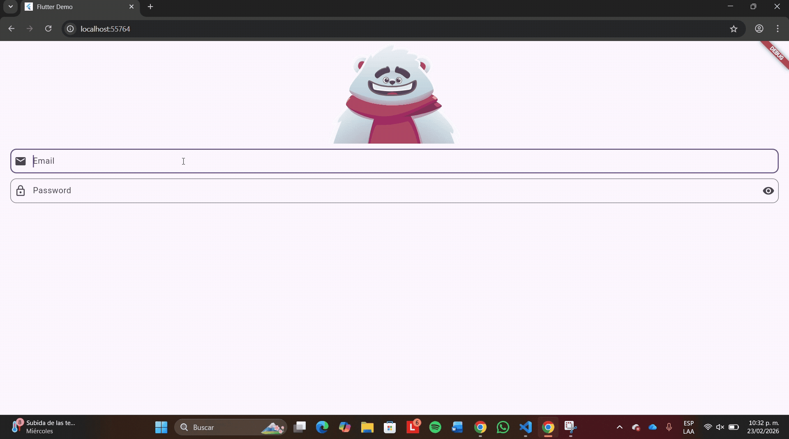

🐻🎯 Smart Animated Login – Flutter + Rive

An interactive authentication screen built with Flutter and powered by real-time animation using Rive State Machines.

This project transforms a traditional login form into a dynamic user experience where animation reacts instantly to user behavior.

🌟 About the Project

Instead of using a static login interface, this application integrates a fully interactive animated character that responds to user actions in real time.

The objective is to demonstrate how animation logic can be connected directly to user input events inside a Flutter application.

✨ Main Features

The login screen includes an animated bear that reacts differently depending on user interaction:

* 📧 When the **email field gains focus**, the bear shifts its gaze toward the text field and follows the typing movement.
* 🔒 When the **password field is selected**, the bear covers its eyes.
* 👁️ A visibility toggle button allows the password to be shown or hidden.
* ⚠️ If validation fails, the bear displays a worried expression.
* 🎉 If both fields are valid, the bear reacts with happiness.

This interaction creates a more engaging and visually expressive login flow.

🎨 What is Rive?

Rive is a real-time animation tool that allows developers to design and integrate interactive animations into applications.

Unlike traditional animations that simply play once, Rive animations can respond to user input thanks to their State Machine system.

🔄 What is a State Machine?

A State Machine is a logic-based animation controller.

It allows transitions between animation states depending on specific triggers or conditions.

In this project, State Machines are responsible for:

* Switching between idle and reaction animations
* Activating error or success states
* Responding to focus changes in input fields
* Managing dynamic animation behavior

🛠️ Technologies Used

* 💙 **Flutter** – Cross-platform development framework
* 🎞️ **Rive** – Interactive animation tool
* 🧠 **State Machines** – Animation logic controller inside Rive
* 🎯 **FocusNode** – Detects when input fields gain or lose focus
* 🔍 **Regex** – Validates email format
* 👂 **Listeners** – Detect changes in user interaction
* 🎮 **Animation Controllers** – Connect Flutter logic to Rive inputs
* 💻 Visual Studio / VS Code – Development environment

📂 Project Structure (lib folder)

The core logic is organized into two main files:

`main.dart`

* Entry point of the application
* Loads and displays the login screen

`login_screen.dart`

* Builds the entire login interface
* Connects text fields to animation triggers
* Handles validation logic
* Manages FocusNodes and State Machine inputs

This separation keeps the application clean and modular.

🎥 Demo
This is how the application looks during interaction:

📘 Academic Information

**Subject:** Graphication
**Professor:** Rodrigo Fidel Gaxiola Sosa

🎨 Animation Credits

The animation used in this project was created by the Rive marketplace author **“dexterc”**.

Original resource available at:
[https://rive.app/marketplace/3645-7621-remix-of-login-machine/](https://rive.app/marketplace/3645-7621-remix-of-login-machine/)

All animation credit belongs to the original creator.

🚀 Final Note

This project demonstrates how combining UI design with animation logic can significantly enhance user experience.

By integrating Flutter with Rive State Machines, we achieve a login interface that feels alive, responsive, and expressive — far beyond a conventional form.
